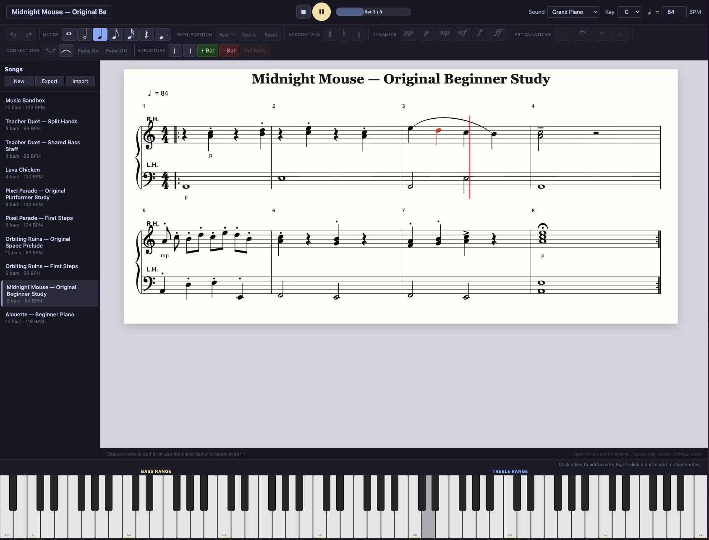
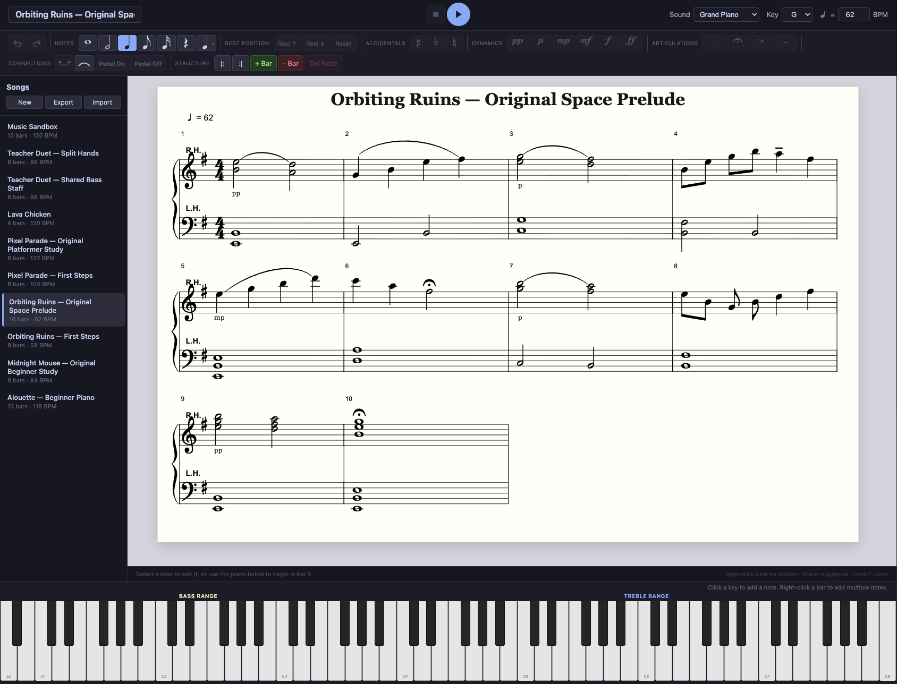
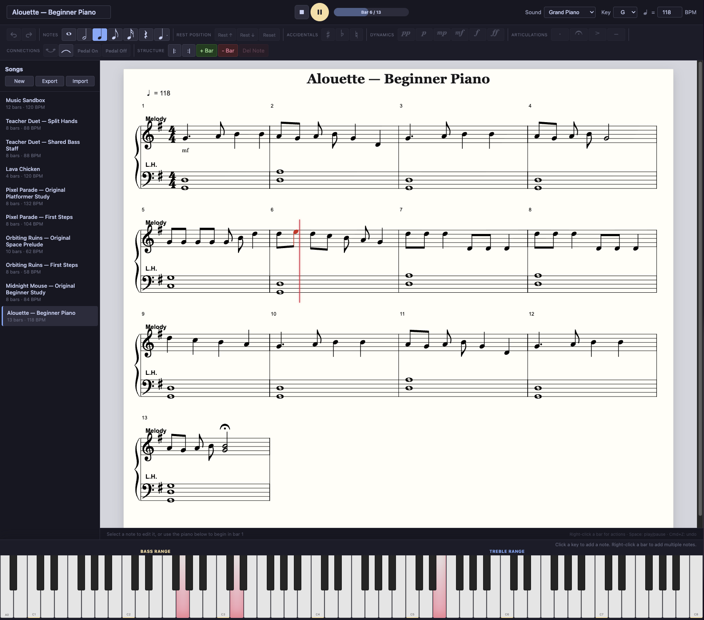
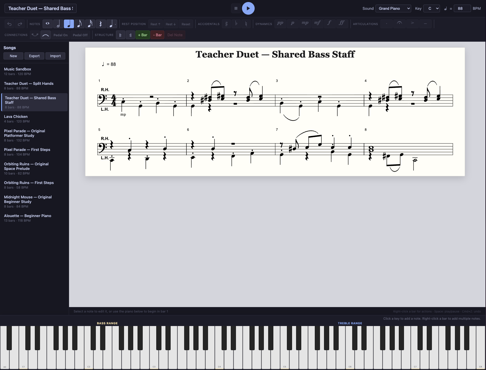

# Piano Sheet

A local-first piano notation editor built with React, TypeScript, VexFlow, and Tone.js. Compose on a grand staff, enter notes or chords from a full 88-key on-screen piano, annotate a score, and play it back with synchronized visual guidance.

## Screenshots

<p align="center">
  
</p>

<p align="center">
  
  
</p>

<p align="center">
  
  
</p>

## Current capabilities

- Grand-staff or single-staff notation with responsive measure wrapping
- Multiple independent rhythmic voices on either staff, including selectable/editable same-staff notes
- Full-width 88-key piano input for notes and explicit chord building/editing
- Five note durations, dotted notes, accidentals, dynamics, and articulations
- Standard key signatures and per-rest vertical positioning
- Ties, slurs, pedal markers, repeat markers, and measure management
- Four playback sounds: sampled grand piano, electric keys, warm pad, and music box
- Playback with pause, resume, repeats, dynamics, articulation timing, and a moving score cursor
- Simultaneous score-note highlighting across staves plus live playback lighting on the piano keys
- Undo/redo and keyboard shortcuts
- Multiple locally saved songs with JSON import/export
- Five bundled, editable sample scores for learning and exploring the editor

Songs and the selected playback sound are stored in browser `localStorage`. The starter library includes Alouette, The Marines’ Hymn, Orbiting Ruins, Pixel Parade, and the shared-bass-staff Teacher Duet. There is no account, server, or cloud sync yet. Grand-piano samples begin loading when the app opens and are fetched from the Tone.js Salamander sample host; the three synthesized sounds do not require sample downloads.

## Run locally

```bash
npm install
npm run dev
```

Vite prints the local URL, usually `http://localhost:5173`.

## Production deployment

The production build is configured for the `/piano/` URL path. Build the app, then copy the contents of `dist/` into the server's `piano/` directory:

```bash
npm run build
```

The resulting entry point is `/piano/index.html`, with its JavaScript, CSS, and public assets loaded from `/piano/`.

## Quality checks

```bash
npm run lint
npm run build
```

There is not yet an automated test suite. The highest-value test coverage to add is listed in [ROADMAP.md](./ROADMAP.md).

## Project map

- `src/App.tsx` — editor state, history, commands, and keyboard shortcuts
- `src/models/song.ts` — persisted score data and timing helpers
- `src/services/renderer.ts` — VexFlow score layout and note hit targets
- `src/services/playback.ts` — Tone.js instruments, transport scheduling, cursor timing, and playback visualization events
- `src/services/storage.ts` — local persistence and validated JSON import/export
- `src/components/` — transport, notation toolbar, song library, and piano input
- `songs/` — importable reference scores and regression fixtures

## Editing model

New songs begin with four empty measures. Click an empty part of a bar to select it; piano input then stays in that bar. Adding a new bar selects it immediately. With no bar or note selected, piano input begins in bar 1. Automatic advance only applies when there is no explicit bar target.

To add a slur, click the arc tool and then select its starting and ending notes. Selecting the same pair again removes the slur; press `Escape` to cancel partway through.

Right-click a bar and choose **Add note(s)** to enter simultaneous notes. Each piano key updates the bar immediately; click an active key again to remove that pitch, press `Enter` to keep the result, or **Cancel**/`Escape` to restore the bar. Right-click an existing note or chord to edit or delete it. A selected note or chord can also be dragged vertically to transpose it; clicking empty staff space directly above or below its notehead adds a natural pitch to the chord.

Useful shortcuts:

- `1`–`5`: whole, half, quarter, eighth, or sixteenth duration
- `R`: toggle rest entry
- `.`: toggle dotted entry
- Arrow left/right: select adjacent notes
- Arrow up/down: move the selected note by a staff step, or nudge a selected rest vertically
- `T`: toggle tie
- `Delete`/`Backspace`: delete selected note
- `Space`: play, pause, or stop loading
- `Escape`: cancel the current slur or note-entry session
- `Cmd/Ctrl+Z`: undo; `Cmd/Ctrl+Shift+Z` or `Ctrl+Y`: redo

## Product plan

See [ROADMAP.md](./ROADMAP.md) for the current priorities, known limitations, and recommended order of work.
