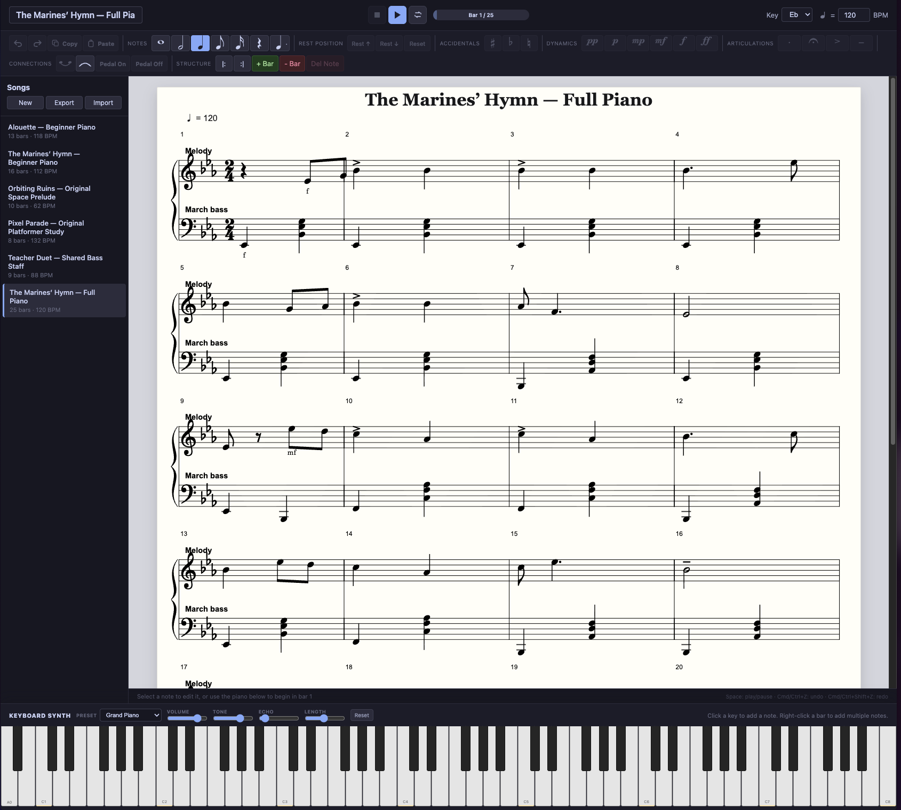

# Piano Sheet

A local-first piano notation editor built with React, TypeScript, VexFlow, and Tone.js. Compose on a grand staff, enter notes or chords from a full 88-key on-screen piano, annotate a score, and play it back with synchronized visual guidance.

<a href="https://kennycason.com/piano/" target="_blank">Demo</a>

## Screenshots

<p align="center">
  
</p>

<p align="center">
  
  
</p>

<p align="center">
  
  
</p>

## Current capabilities

- Grand-staff or single-staff notation with responsive measure wrapping
- Multiple independent rhythmic voices on either staff, including selectable/editable same-staff notes
- Full-width 88-key piano input for notes and explicit chord building/editing
- Five note durations, dotted notes, accidentals, dynamics, and articulations
- Standard key signatures and per-rest vertical positioning
- Correct measure-scoped accidentals plus ties and slurs across bar and system boundaries
- Pedal markers, repeat markers, fermatas, and measure management
- A playable keyboard synth with 12 pitched/percussion presets plus volume, tone, echo, and note-length controls
- Playback with pause, resume, seamless whole-song looping, repeats, sustained pedal, fermata timing, dynamics, articulations, and a moving score cursor
- Simultaneous score-note highlighting across staves plus live playback lighting on the piano keys
- Two optional pitch-letter views: letters centered inside noteheads, or high-contrast note/chord labels below; either mode also labels every key on the piano
- Note, chord, rest, and whole-bar copy/paste with undo/redo and keyboard shortcuts
- Multiple locally saved songs with versioned, validated JSON import/export and recovery-safe saves
- Track-aware MIDI import with chord, hand/staff, overlapping-voice, percussion, General MIDI instrument, tempo, meter, and key mapping
- Multitrack score navigation with per-track notation, sounds, keyboard lighting, mute/solo, and full-arrangement playback
- Responsive touch-friendly mobile editing, keyboard-accessible score actions, and non-blocking song deletion with undo
- Eight bundled, editable sample projects for learning and exploring the editor

Songs, tracks, and each track's selected sound controls are stored in browser `localStorage`. The starter library opens Alouette on a visitor's first run and also includes the multitrack Lower Norfair theme, Moonlight Sonata, beginner and full-piano versions of The Marines’ Hymn, Orbiting Ruins, Pixel Parade, and the shared-bass-staff Teacher Duet. Returning visitors keep their previously selected project. There is no account, server, or cloud sync yet. Grand-piano samples are fetched from the Tone.js Salamander sample host; if they are unavailable, playback falls back to Electric Keys. Synthesized instruments and drums do not require sample downloads.

MIDI files are converted into ordinary editable project tracks and are never played directly after import. Every non-empty MIDI track remains independently navigable, retains its channel/program metadata, receives a matching starter sound, and participates in ensemble playback. Percussion becomes an editable percussion-clef score with General MIDI drum labels and synthesized drum sounds. Notes are quantized to the nearest sixteenth; simultaneous notes of equal length become chords, pitched notes below middle C are assigned to bass, and overlaps become independent voices. Secondary-voice timing gaps remain as invisible spacing rests. The import summary calls out tempo, key, meter, or quantization compromises; JSON remains the lossless project format.

## Run locally

```bash
npm install
npm run dev
```

Vite prints the local URL, usually `http://localhost:5173`.

## Production deployment

The production build is configured for the `/piano/` URL path. Build the app, then copy the contents of `dist/` into the server's `piano/` directory:

```bash
npm run build
```

The resulting entry point is `/piano/index.html`, with its JavaScript, CSS, and public assets loaded from `/piano/`.

## Quality checks

```bash
npm run lint
npm test
npm run build
```

The unit suite covers score timing and accidentals, cross-bar/chord ties, repeat expansion, schema migration and validation, every checked-in song fixture, recovery-safe storage, and multi-track MIDI conversion. GitHub Actions runs lint, tests, and the production build on every push and pull request. Browser-level interaction coverage is the next testing priority.

## Project map

- `src/App.tsx` — editor state, history, commands, and keyboard shortcuts
- `src/models/song.ts` — persisted score data and timing helpers
- `src/services/renderer.ts` — VexFlow score layout and note hit targets
- `src/services/playback.ts` — Tone.js instruments, transport scheduling, cursor timing, and playback visualization events
- `src/services/storage.ts` — local persistence and validated JSON import/export
- `src/services/midi.ts` — quantized MIDI-to-score conversion and track/voice mapping
- `src/components/` — transport, notation toolbar, song library, and piano input
- `songs/` — importable reference scores and regression fixtures

## Editing model

New songs begin with four empty measures. Click an empty part of a bar to select it; piano input then stays in that bar. Adding a new bar selects it immediately. With no bar or note selected, piano input begins in bar 1. Automatic advance only applies when there is no explicit bar target.

For multitrack projects, use the track picker in the top bar to switch the visible score and keyboard sound. **Solo** plays only the visible track; **Mute** removes it from ensemble playback. Playback normally performs every unmuted track while score and keyboard highlights follow the visible track.

To add a slur, click the arc tool and then select its starting and ending notes. Selecting the same pair again removes the slur; press `Escape` to cancel partway through.

Right-click a bar and choose **Add note(s)** to enter simultaneous notes. Each piano key updates the bar immediately; click an active key again to remove that pitch, press `Enter` to keep the result, or **Cancel**/`Escape` to restore the bar. Right-click an existing note or chord to edit or delete it. A selected note or chord can also be dragged vertically to transpose it; clicking empty staff space directly above or below its notehead adds a natural pitch to the chord.

Useful shortcuts:

- `1`–`5`: whole, half, quarter, eighth, or sixteenth duration
- `R`: toggle rest entry
- `.`: toggle dotted entry
- Arrow left/right: select adjacent notes
- Arrow up/down: move the selected note by a staff step, or nudge a selected rest vertically
- `T`: toggle tie
- `Delete`/`Backspace`: delete selected note
- `Cmd/Ctrl+C`: copy the selected note, chord, rest, or bar
- `Cmd/Ctrl+V`: paste a note after the selection, or duplicate a copied bar after the selected bar
- `Space`: play, pause, or stop loading
- `Escape`: cancel the current slur or note-entry session
- `Cmd/Ctrl+Z`: undo; `Cmd/Ctrl+Shift+Z` or `Ctrl+Y`: redo

## Product plan

See [ROADMAP.md](./ROADMAP.md) for the current priorities, known limitations, and recommended order of work.
